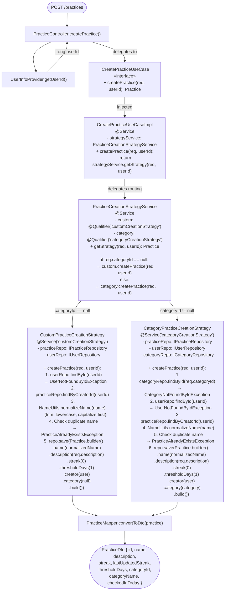
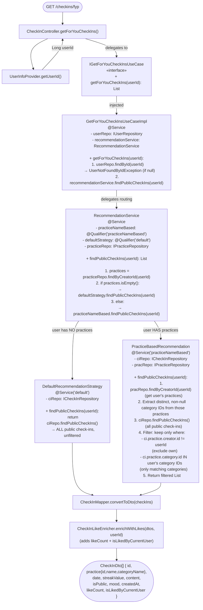
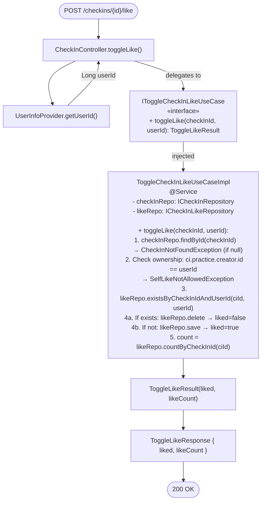
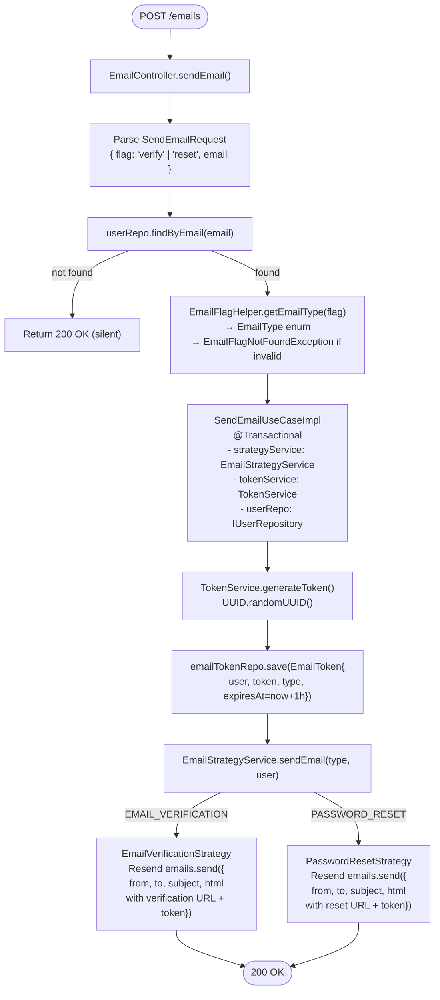
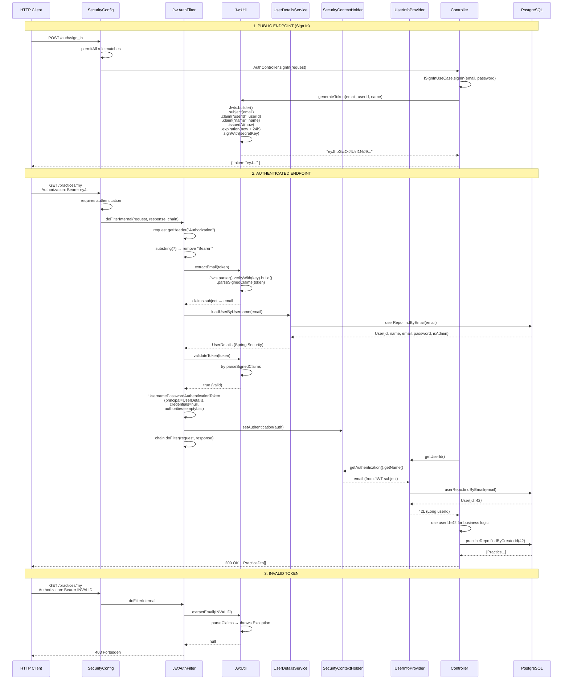
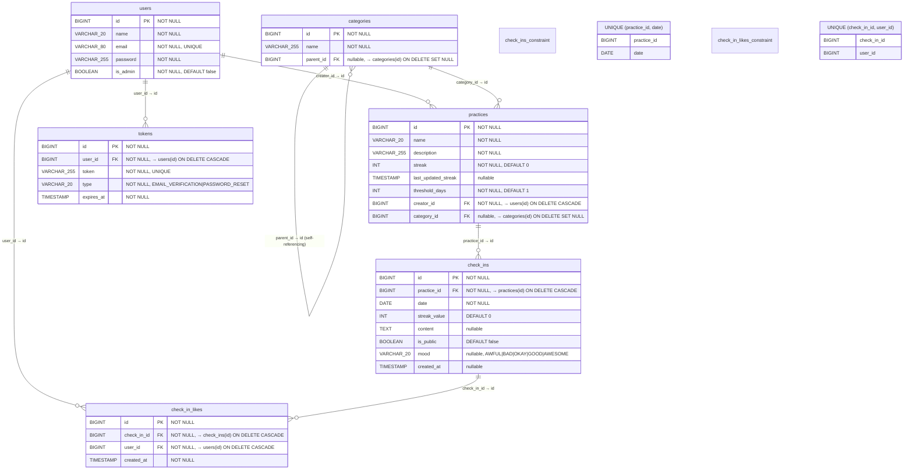

# Solen — Backend Architecture

> Mermaid diagrams documenting the Spring Boot REST API architecture.

---

## 1. Full Layered Architecture (Hexagonal / Port-Adapter)

```mermaid
graph TB
    subgraph "CONTROLLER LAYER [REST Endpoints]"
        PC["PracticeController<br/>@RestController /practices"]
        CC["CheckInController<br/>@RestController /checkins"]
        AC["AuthController<br/>@RestController /auth"]
        CatC["CategoryController<br/>@RestController"]
        UC["UserController<br/>@RestController /users"]
        EC["EmailController<br/>@RestController /emails"]

        MAPPERS["PracticeMapper<br/>CheckInMapper<br/>UserMapper<br/>CategoryMapper<br/>← Domain ↔ DTO →"]

        DTOs["CreatePracticeRequest<br/>PracticeDto<br/>CheckInDto / CreateCheckInRequest / UpdateCheckInRequest<br/>SignInRequest / SignInResponse<br/>CategoryResponse (recursive tree)<br/>UserDto / CreateUserRequest / UpdateUserRequest<br/>ToggleLikeResponse<br/>SendEmailRequest"]
    end

    subgraph "BUSINESS / USE CASE LAYER"
        subgraph "Use Case Interfaces"
            ICPU["ICreatePracticeUseCase"]
            IDPU["IDeletePracticeUseCase"]
            IGPU["IGetPracticesByUserUseCase"]
            IUSU["IUpdateStreakUseCase"]
            ICCU["ICreateCheckInUseCase"]
            IGCU["IGetCheckInsForUserUseCase"]
            IUCI["IUpdateCheckInUseCase"]
            IDCI["IDeleteCheckInUseCase"]
            IGFY["IGetForYouCheckInsUseCase"]
            ISIU["ISignInUseCase"]
            ITCL["IToggleCheckInLikeUseCase"]
            ISEU["ISendEmailUseCase"]
            IVTU["IVerifyTokenUseCase"]
        end

        subgraph "Strategy: Practice Creation"
            PSS["PracticeCreationStrategyService (router)<br/>+ getStrategy(req,userId): Practice"]
            CusS["CustomPracticeCreationStrategy<br/>@Service('customCreationStrategy')<br/>- repo: IPracticeRepository<br/>- userRepo: IUserRepository"]
            CatS["CategoryPracticeCreationStrategy<br/>@Service('categoryCreationStrategy')<br/>- repo: IPracticeRepository<br/>- userRepo: IUserRepository<br/>- categoryRepo: ICategoryRepository"]
            IPS["IPracticeCreationStrategy<br/>«interface»<br/>+ createPractice(req,userId): Practice"]
        end

        subgraph "Strategy: FYP Recommendations"
            RS["RecommendationService (router)<br/>+ findPublicCheckIns(userId): List<CheckIn>"]
            PBR["PracticeBasedRecommendation<br/>@Service('practiceNameBased')<br/>- ciRepo: ICheckInRepository<br/>- pracRepo: IPracticeRepository"]
            DRS["DefaultRecommendationStrategy<br/>@Service('default')<br/>- ciRepo: ICheckInRepository"]
            IRS["IRecommendationStrategy<br/>«interface»<br/>+ findPublicCheckIns(userId): List<CheckIn>"]
        end

        subgraph "Strategy: Email Sending"
            ESS["EmailStrategyService (router)<br/>- verification: EmailVerificationStrategy<br/>- passwordReset: PasswordResetStrategy<br/>+ sendEmail(type, user): void"]
            EVS["EmailVerificationStrategy<br/>@Service<br/>- tokenService: TokenService<br/>- resend: Resend"]
            PRS["PasswordResetStrategy<br/>@Service<br/>- tokenService: TokenService<br/>- resend: Resend"]
            IES["IEmailStrategy<br/>«interface»<br/>+ sendEmail(user): void"]
        end

        subgraph "Other Business Services"
            SV["StreakValidator<br/>+ validateStreak(practice): void<br/>(resets streak to 0 if threshold exceeded)"]
            NU["NameUtils<br/>+ normalizeName(name): String<br/>(trim, lowercase, capitalize first)"]
            UDS["UserDetailsService<br/>+ loadUserByUsername(email): UserDetails"]
            CLE["CheckInLikeEnricher<br/>+ enrichWithLikes(dtos, userId): void<br/>(adds likeCount + isLikedByCurrentUser)"]
            TS["TokenService<br/>+ generateToken(): String<br/>+ buildVerificationUrl(token): String<br/>+ verifyToken(token): EmailToken"]
            EFH["EmailFlagHelper<br/>+ getEmailType(flag): EmailType<br/>(maps 'verify'/'reset' → enum)"]
        end

        subgraph "Repository Port Interfaces"
            IPr["IPracticeRepository<br/>save / findById / findAll<br/>findByName / findByCreatorId<br/>deleteById / existsByPracticeIdAndCreatorEmail"]
            ICr["ICheckInRepository<br/>save / findById / findByPracticeCreatorId<br/>findCheckInsForUser / findPublicCheckIns<br/>findPracticeIdsCheckedInTodayByUserId / deleteById<br/>findByCheckInIdAndEmail"]
            IUr["IUserRepository<br/>save / findById / findByEmail<br/>findAll / deleteById / existsByEmail / existsById"]
            ICatR["ICategoryRepository<br/>save / findById / findAll<br/>findRootCategories / deleteById / existsByName"]
            ICLR["ICheckInLikeRepository<br/>save / deleteByCheckInIdAndUserId<br/>countByCheckInId / existsByCheckInIdAndUserId<br/>findByCheckInIdAndUserId"]
            IETR["IEmailTokenRepository<br/>save / findByToken<br/>deleteByUserIdAndType"]
        end

        subgraph "Custom Exceptions"
            Ex1["UserNotFoundByIdException(id)"]
            Ex2["UserNotFoundByEmailException(email)"]
            Ex3["PracticeNotFoundByIdException(id)"]
            Ex4["PracticeAlreadyExistsException"]
            Ex5["CheckInNotFoundException(id)"]
            Ex6["CategoryNotFoundByIdException(id)"]
            Ex7["EmailAlreadyExistsException(email)"]
            Ex8["StreakAlreadyUpdatedException"]
            Ex9["SelfLikeNotAllowedException"]
            Ex10["EmailFlagNotFoundException(flag)"]
            Ex11["TokenNotFoundException(token)"]
        end
    end

    subgraph "PERSISTENCE LAYER [Adapters]"
        subgraph "Adapter Implementations"
            PR["PracticeRepository<br/>@Repository implements IPracticeRepository<br/>- jpa: PracticeJpaRepository<br/>- conv: PracticeConverter"]
            CR["CheckInRepository<br/>@Repository implements ICheckInRepository<br/>- jpa: CheckInJpaRepository<br/>- conv: CheckInConverter"]
            UR["UserRepository<br/>@Repository implements IUserRepository<br/>- jpa: UserJpaRepository<br/>- conv: UserConverter"]
            CatR["CategoryRepository<br/>@Repository implements ICategoryRepository<br/>- jpa: CategoryJpaRepository<br/>- conv: CategoryConverter"]
            CLR["CheckInLikeRepository<br/>@Repository implements ICheckInLikeRepository<br/>- jpa: CheckInLikeJpaRepository<br/>- conv: CheckInLikeConverter"]
            ETR["EmailTokenRepository<br/>@Repository implements IEmailTokenRepository<br/>- jpa: EmailTokenJpaRepository<br/>- conv: EmailTokenConverter"]
        end

        subgraph "JPA Spring Data Repositories"
            PJ["PracticeJpaRepository<br/>extends JpaRepository<PracticeEntity, Long>"]
            CJ["CheckInJpaRepository<br/>extends JpaRepository<CheckInEntity, Long><br/>+ findByIdWithPracticeAndCreator(id)<br/>+ findPublicCheckIns()<br/>+ findPracticeIdsCheckedInOnDate(userId, date)"]
            UJ["UserJpaRepository<br/>extends JpaRepository<UserEntity, Long><br/>+ findByEmail(email): UserEntity"]
            CatJ["CategoryJpaRepository<br/>extends JpaRepository<CategoryEntity, Long><br/>+ findByParentIsNull(): List<CategoryEntity>"]
            CLJ["CheckInLikeJpaRepository<br/>extends JpaRepository<CheckInLikeEntity, Long><br/>+ deleteByCheckInIdAndUserId(ciId, userId)<br/>+ countByCheckInId(ciId): Long<br/>+ existsByCheckInIdAndUserId(ciId, userId): boolean<br/>+ findByCheckInIdAndUserId(ciId, userId): Optional"]
            ETJ["EmailTokenJpaRepository<br/>extends JpaRepository<EmailTokenEntity, Long><br/>+ findByToken(token): Optional<br/>+ deleteByUserIdAndType(userId, type)"]
        end

        subgraph "Converters (Entity ↔ Domain)"
            PConv["PracticeConverter<br/>+ convertToEntity(Practice): PracticeEntity<br/>+ convertToDomain(PracticeEntity): Practice"]
            CConv["CheckInConverter<br/>+ convertToEntity(CheckIn): CheckInEntity<br/>+ convertToDomain(CheckInEntity): CheckIn"]
            UConv["UserConverter<br/>+ convertToEntity(User): UserEntity<br/>+ convertToDomain(UserEntity): User"]
            CatConv["CategoryConverter<br/>+ convertToEntity(Category): CategoryEntity<br/>+ convertToDomain(CategoryEntity): Category<br/>+ convertToDomainWithChildren(CategoryEntity): Category"]
            CLConv["CheckInLikeConverter<br/>+ convertToEntity(CheckInLike): CheckInLikeEntity<br/>+ convertToDomain(CheckInLikeEntity): CheckInLike"]
            ETConv["EmailTokenConverter<br/>+ convertToEntity(EmailToken): EmailTokenEntity<br/>+ convertToDomain(EmailTokenEntity): EmailToken"]
        end

        subgraph "JPA Entities"
            PE["PracticeEntity<br/>@Entity @Table('practices')<br/>id, name, description, streak<br/>lastUpdatedStreak, thresholdDays<br/>@ManyToOne category → CategoryEntity<br/>@ManyToOne creator → UserEntity"]
            CE["CheckInEntity<br/>@Entity @Table('check_ins')<br/>@UniqueConstraint(practice_id+date)<br/>id, date, streakValue, content<br/>isPublic, @Enumerated STRING mood<br/>createdAt<br/>@ManyToOne practice → PracticeEntity"]
            UE["UserEntity<br/>@Entity @Table('users')<br/>id, name, email(unique), password, isAdmin"]
            CatE["CategoryEntity<br/>@Entity @Table('categories')<br/>id, name<br/>@ManyToOne parent → CategoryEntity<br/>@OneToMany children → CategoryEntity"]
            CLE2["CheckInLikeEntity<br/>@Entity @Table('check_in_likes')<br/>id, checkInId, userId, createdAt"]
            ETE["EmailTokenEntity<br/>@Entity @Table('tokens')<br/>id, userId, token, type, expiresAt"]
        end
    end

    subgraph "DOMAIN LAYER [Pure POJOs]"
        Prac["Practice<br/>@Data @Builder<br/>id: Long, name: String<br/>description: String, streak: int<br/>lastUpdatedStreak: LocalDateTime<br/>thresholdDays: int<br/>category: Category, creator: User"]
        CI["CheckIn<br/>@Data @Builder<br/>id: Long, practice: Practice<br/>date: LocalDate, streakValue: int<br/>content: String, isPublic: boolean<br/>mood: Mood, createdAt: LocalDateTime"]
        U["User<br/>@Data @Builder<br/>id: Long, name: String<br/>email: String, password: String<br/>isAdmin: boolean"]
        Cat["Category<br/>@Data @Builder<br/>id: Long, name: String<br/>parent: Category, children: List<Category>"]
        Mood["Mood<br/>«enum»<br/>AWFUL | BAD | OKAY | GOOD | AWESOME"]
        CIL["CheckInLike<br/>@Data @Builder<br/>id: Long, checkInId: Long<br/>userId: Long, createdAt: LocalDateTime"]
        ET["EmailToken<br/>@Data @Builder<br/>id: Long, user: User<br/>token: String, type: EmailType<br/>expiresAt: LocalDateTime"]
        EType["EmailType<br/>«enum»<br/>EMAIL_VERIFICATION | PASSWORD_RESET"]
    end

    subgraph "CROSS-CUTTING: Security & Config"
        SC["SecurityConfig<br/>@EnableWebSecurity<br/>- CORS: frontend.url<br/>- CSRF: disabled<br/>- permitAll: OPTIONS, /auth/**, POST /users, /, /actuator/health<br/>- all others: authenticated<br/>- stateless sessions<br/>- JwtAuthFilter before UsernamePasswordAuthenticationFilter<br/>- PasswordEncoder: DelegatingPasswordEncoder"]
        JAF["JwtAuthFilter<br/>extends OncePerRequestFilter<br/>doFilterInternal():<br/>1. Extract Bearer token<br/>2. JwtUtil.extractEmail(token)<br/>3. UserDetailsService.loadByUsername(email)<br/>4. JwtUtil.validateToken(token)<br/>5. Set SecurityContext"]
        JU["JwtUtil<br/>- key: SecretKey (HMAC-SHA256)<br/>+ generateToken(email, userId, name): String<br/>+ extractEmail(token): String<br/>+ validateToken(token): boolean<br/>expiry: 24 hours"]
        UIP["UserInfoProvider<br/>+ getUserId(): Long<br/>+ getUserEmail(): String<br/>(email → SecurityContext → UserRepository)"]
        WebC["WebConfig<br/>CORS: localhost:5173"]
        GEH["GlobalExceptionHandler<br/>@RestControllerAdvice<br/>10+ @ExceptionHandler methods"]
        RConfig["ResendConfig<br/>Resend API key injection"]
        PS["PracticeSecurity<br/>@Component<br/>+ isOwnerByEmail(id, email): boolean"]
        CIS["CheckInSecurity<br/>@Component<br/>+ isOwnerByEmail(id, email): boolean"]
        CatS2["CategorySecurity<br/>@Component<br/>+ isAdminByEmail(email): boolean"]
    end

    subgraph "DATABASE"
        DB[(PostgreSQL 16<br/>via Supabase)]
    end

    %% Controller → Use Case wiring
    PC --> ICPU & IDPU & IGPU & IUSU
    CC --> ICCU & IGCU & IUCI & IDCI & IGFY & ITCL
    AC --> ISIU
    EC --> ISEU & IVTU
    CatC --> CatC_UC["ICreateCategory / IUpdateCategory / IDeleteCategory / IGetCategoryTree / IGetCategoryById"]
    UC --> UC_UC["CreateUser / DeleteUser / GetUsers / GetUserById / UpdateUser"]

    %% Use Case → Strategy wiring
    ICPU --> PSS
    PSS --> CusS & CatS
    CusS --> IPS
    CatS --> IPS

    IGFY --> RS
    RS --> PBR & DRS
    PBR --> IRS
    DRS --> IRS

    ISEU --> ESS
    ESS --> EVS & PRS
    EVS --> IES
    PRS --> IES

    %% Use Case → Port Interfaces
    IPr --> PR
    ICr --> CR
    IUr --> UR
    ICatR --> CatR
    ICLR --> CLR
    IETR --> ETR

    %% Adapter → JPA + Converter
    PR --> PJ & PConv
    CR --> CJ & CConv
    UR --> UJ & UConv
    CatR --> CatJ & CatConv
    CLR --> CLJ & CLConv
    ETR --> ETJ & ETConv

    %% Converter → Entity + Domain
    PConv --> PE & Prac
    CConv --> CE & CI
    UConv --> UE & U
    CatConv --> CatE & Cat
    CLConv --> CLE2 & CIL
    ETConv --> ETE & ET

    %% JPA → DB
    PJ & CJ & UJ & CatJ & CLJ & ETJ --> DB

    %% Security wiring
    SC --> JAF
    JAF --> JU & UDS
    UIP --> IUr
    PS & CIS & CatS2 --> SC
```



---

## 2. Strategy Pattern: Practice Creation



---

## 3. Strategy Pattern: FYP (For You Page) Recommendations



---

## 4. Check-In Like Toggle Flow



---

## 5. Email Send Flow



---

## 6. Authentication Filter Chain



---

## 7. Database Entity-Relationship Diagram



---

## 8. API Endpoint Map

```mermaid
graph LR
    subgraph "AUTH"
        AAPI["POST /auth/sign_in<br/>Body: {email, password}<br/>→ {token}"] -->|"permitAll"| AUTH["AuthController"]
    end

    subgraph "USERS"
        USR1["POST /users<br/>Body: {name, email, password, isAdmin}"] -->|"permitAll"| UC["UserController"]
        USR2["GET /users"] -->|"authenticated"| UC
        USR3["GET /users/{id}"] -->|"authenticated"| UC
        USR4["PUT /users/{id}"] -->|"authenticated"| UC
        USR5["DELETE /users/{id}"] -->|"authenticated"| UC
    end

    subgraph "PRACTICES"
        PR1["POST /practices<br/>Body: {name, description, categoryId}"] -->|"authenticated"| PC["PracticeController"]
        PR2["GET /practices/my"] -->|"authenticated"| PC
        PR3["PUT /practices/{id}<br/>(update streak)"] -->|"@PreAuthorize<br/>practiceSecurity"| PC
        PR4["DELETE /practices/{id}"] -->|"@PreAuthorize<br/>practiceSecurity"| PC
    end

    subgraph "CHECK-INS"
        CI1["GET /checkins?from=&to="] -->|"authenticated"| CC["CheckInController"]
        CI2["POST /checkins/checkin<br/>Body: {practiceId, mood, content, public}"] -->|"authenticated"| CC
        CI3["PUT /checkins/{id}<br/>Body: {content, mood, public}"] -->|"@PreAuthorize<br/>checkInSecurity"| CC
        CI4["DELETE /checkins/{id}"] -->|"@PreAuthorize<br/>checkInSecurity"| CC
        CI5["GET /checkins/fyp"] -->|"authenticated"| CC
        CI6["POST /checkins/{id}/like<br/>→ {liked, likeCount}"] -->|"authenticated"| CC
    end

    subgraph "CATEGORIES"
        CAT1["GET /categories"] -->|"authenticated"| CatC["CategoryController"]
        CAT2["GET /categories/{id}"] -->|"authenticated"| CatC
        CAT3["POST /admin/categories"] -->|"@PreAuthorize<br/>categorySecurity"| CatC
        CAT4["PUT /admin/categories/{id}"] -->|"@PreAuthorize<br/>categorySecurity"| CatC
        CAT5["DELETE /admin/categories/{id}"] -->|"@PreAuthorize<br/>categorySecurity"| CatC
    end

    subgraph "EMAILS"
        EML1["POST /emails<br/>Body: {flag, email}"] -->|"authenticated"| EC["EmailController"]
    end

    subgraph "MONITORING"
        ACT["GET /actuator/health"] -->|"permitAll"| Actuator
    end
```
