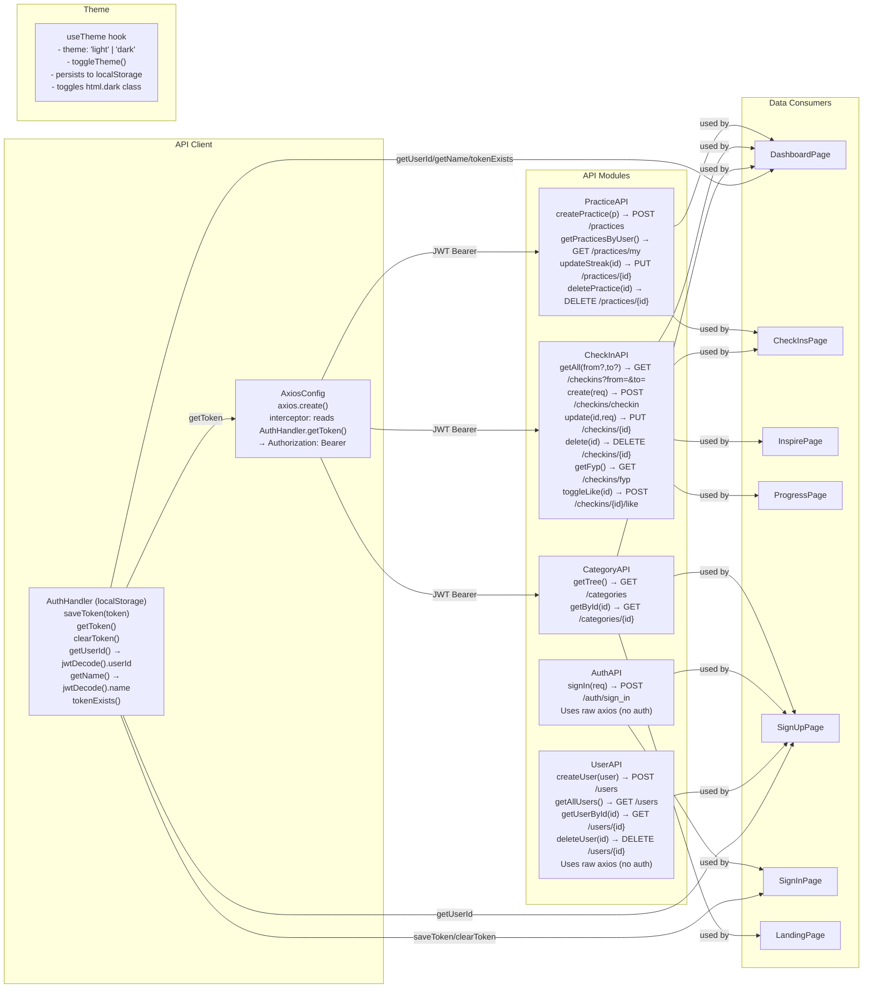
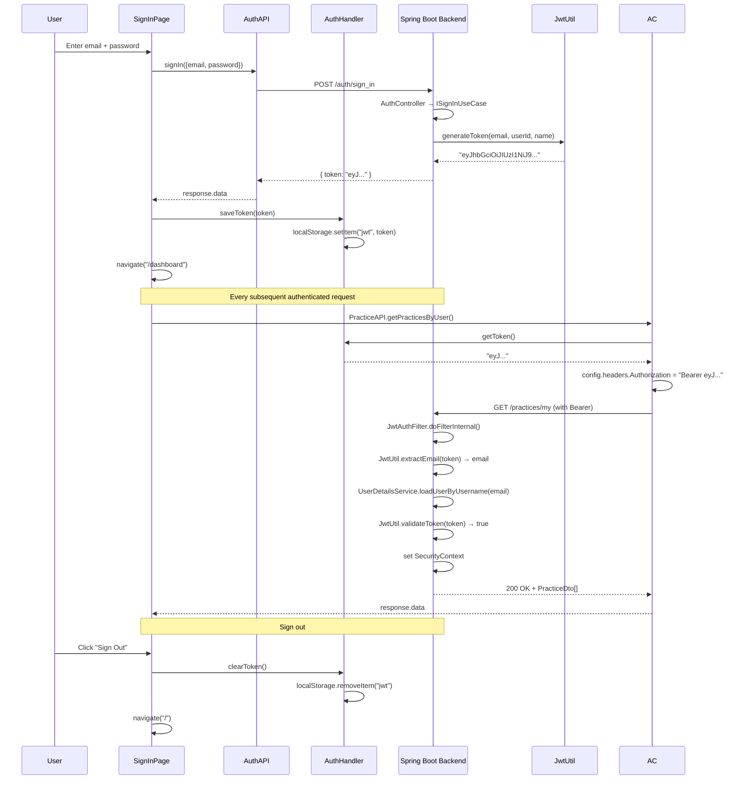
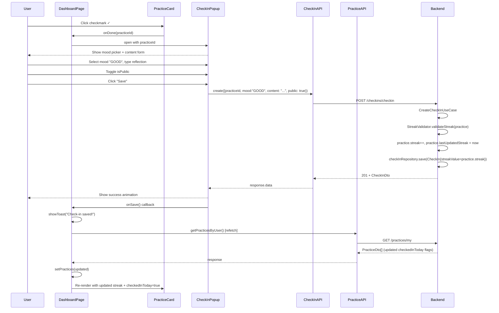
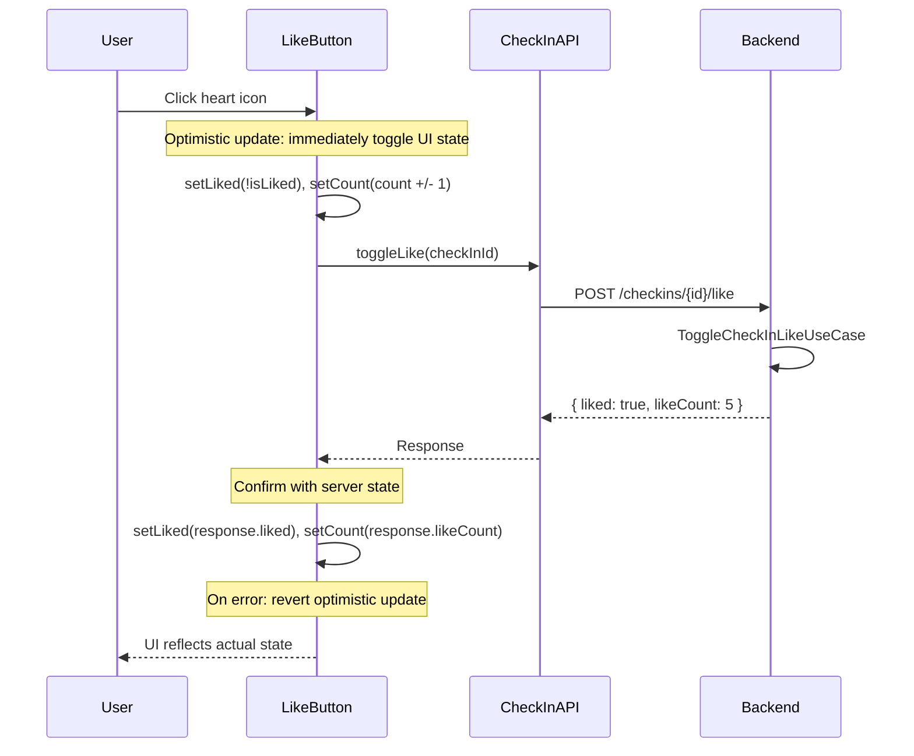
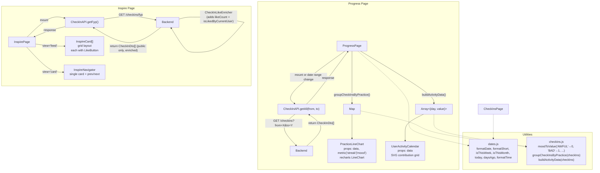
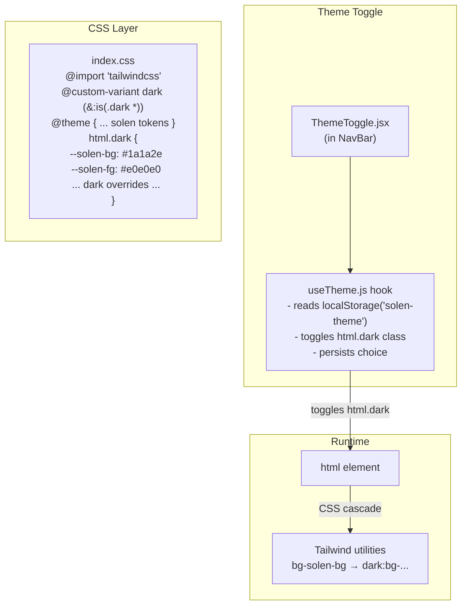
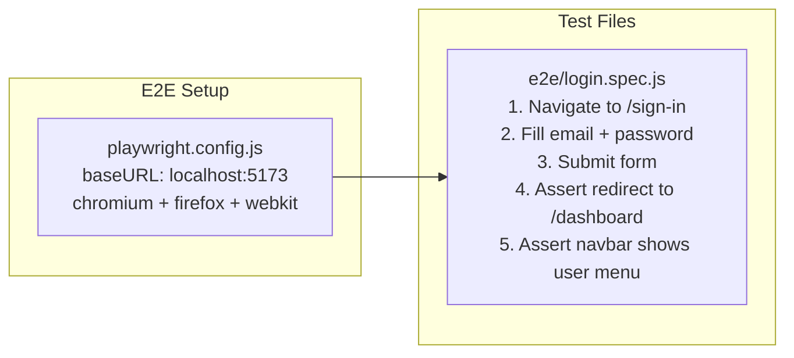

# Solen — Frontend Architecture

> Mermaid diagrams documenting the React SPA architecture.

---

## 1. Component Hierarchy — React Component Tree

```mermaid
graph TD
    subgraph "Entry"
        M["main.jsx<br/>StrictMode > BrowserRouter"] --> A["App.jsx<br/>NavBar + Routes"]
    end

    subgraph "Routing"
        A --> NB["NavBar<br/>uses: useLocation, useNavigate, AuthHandler<br/>includes: ThemeToggle (dark/light)"]
        A --> R0["Route / → LandingPage"]
        A --> R1["Route /dashboard → DashboardPage"]
        A --> R2["Route /checkins → CheckInsPage"]
        A --> R3["Route /sign-up → SignUpPage"]
        A --> R4["Route /sign-in → SignInPage"]
        A --> R5["Route /inspire → InspirePage"]
        A --> R6["Route /progress → ProgressPage"]
    end

    subgraph "LandingPage"
        LP["LandingPage"] --> SI["SunIllustration<br/>(decorative animated CSS)"]
        LP --> CTB["CategoryTreeBrowser<br/>props: { onSelect }<br/>state: tree, leafNames, selectedIds"]
        CTB -->|"on mount"| CATAPI["CategoryAPI.getTree()"]
        CTB --> TV["TreeView"]
    end

    subgraph "SignInPage"
        SIP["SignInPage<br/>state: email, password, error<br/>handleSignIn → AuthAPI.signIn"] --> AAPI["AuthAPI.signIn()"]
        SIP --> Input
        SIP --> Label
        SIP --> Button
        SIP --> AS["AuthSun"]
    end

    subgraph "SignUpPage"
        SUP["SignUpPage<br/>state: step(1|2), name, email, password"] -->|"Step 1"| UAPI["UserAPI.createUser()"]
        SUP -->|"Step 1"| AAPI2["AuthAPI.signIn()"]
        SUP -->|"Step 2"| CTB2["CategoryTreeBrowser<br/>onSelect → PracticeAPI.createPractice()"]
        SUP --> AS2["AuthSun"]
    end

    subgraph "DashboardPage"
        DP["DashboardPage<br/>state: practices[], toast, showCreateModal<br/>       newName, newDesc, newCategoryId<br/>       deleteTarget, popupPractice"] --> PH["PageHeader<br/>props: eyebrow, title"]
        DP --> DCF["DailyCheckInForm<br/>props: { practices, onSave }<br/>state: hidden, mood, reflection, selectedPracticeId, isPublic"]
        DP --> PCL["PracticeCardList<br/>props: { practices, onDone, onDelete }"]
        PCL --> PC["PracticeCard<br/>props: { practice{id,name,categoryName,streak,checkedInToday}, onDone, onDelete }"]
        DP --> CPM["CreatePracticeModal<br/>props: { isOpen, onClose, onCreate, categoryId, setCategoryId, name, setName, description, setDescription }"]
        CPM --> TV2["TreeView<br/>props: { nodes, onSelect }"]
        DP --> CP["CheckInPopup<br/>props: { isOpen, practiceId, practiceName, onSave, onClose }<br/>state: mood, content, isPublic, saving, success"]
        DP --> DCD["DeleteConfirmationDialog<br/>props: { isOpen, practiceName, onCancel, onConfirm }"]
        DP --> Toast["Toast notification<br/>(from useToast hook, 2.5s auto-dismiss)"]
    end

    subgraph "CheckInsPage"
        CIP["CheckInsPage<br/>state: entries[], practices[], editEntry<br/>       showEdit, showNew, toast"] --> CT["CheckInTimeline<br/>props: { entries, onEdit, onDelete, onCreate }<br/>state: activeFilter('all'|'this-week'|'this-month')"]
        CT --> CTE["CheckInTimelineEntry<br/>props: { entry{id,date,createdAt,mood,practice,categoryName,name,content,isPublic,likeCount,isLikedByCurrentUser}, onEdit, onDelete }"]
        CTE --> LB1["LikeButton<br/>(inline on each entry)"]
        CIP --> CE["EditCheckInModal<br/>props: { isOpen, entry, onSave, onClose }<br/>state: content, mood, isPublic"]
        CIP --> CP2["CheckInPopup<br/>props: { isOpen, onSave, onClose, availablePractices }"]
    end

    subgraph "InspirePage"
        IP["InspirePage<br/>state: entries[], view('feed'|'card')"] --> ICard["InspireCard<br/>props: { entry{user:{name}, practice:{categoryName}, mood, content, date, likeCount, isLikedByCurrentUser} }"]
        ICard --> LB2["LikeButton<br/>(heart icon with count)"]
        IP --> INav["InspireNavigator<br/>props: { entries[] }<br/>state: index"]
    end

    subgraph "ProgressPage"
        PP["ProgressPage<br/>state: progressPerPractice[], contribution[]<br/>       startDate, endDate, activePreset, customOpen"] --> PLC["PracticeLineChart<br/>props: { data{date,streakValue,moodValue}[], metric('streak'|'mood') }<br/>uses recharts LineChart"]
        PP --> UAC["UserActivityCalendar<br/>props: { data{day, value}[] }<br/>(custom SVG calendar)"]
    end

    subgraph "UI Primitives"
        Button["Button<br/>props: { variant('primary'|'secondary'|'ghost'|'danger'), size('md'|'sm'), disabled, onClick }"]
        Modal["Modal<br/>props: { isOpen, onClose, children, maxWidth }<br/>closes on Escape + backdrop click"]
        Card["Card<br/>props: { className, children }"]
        Input["Input<br/>props: { size('md'|'sm'), className }"]
        Label["Label<br/>props: { htmlFor, children }"]
        Textarea["Textarea<br/>props: { size('md'|'sm'), className }"]
        ToggleSwitch["ToggleSwitch<br/>props: { checked, onChange, id, label }<br/>role='switch'"]
        Badge["Badge<br/>props: { children }<br/>rounded pill"]
        TreeView["TreeView<br/>props: { nodes, selectedIds, onToggle, onSelect, defaultOpenDepth, showIcons }<br/>recursive TreeNode"]
        PageHeader["PageHeader<br/>props: { eyebrow, title, className }"]
        MoodIcon["MoodIcon<br/>props: { mood('AWFUL'|'BAD'|'OKAY'|'GOOD'|'AWESOME'), size }<br/>inline SVG faces"]
        AuthSun["AuthSun<br/>props: { size, className }<br/>decorative sun + orbit"]
        LikeButtonUI["LikeButton<br/>props: { checkInId, isLiked, likeCount, onToggle }<br/>heart icon + count, optimistic update"]
    end

    subgraph "Navigation"
        NavBarUI["NavBar<br/>includes: ThemeToggle<br/>uses: useLocation, useNavigate, AuthHandler"]
        ThemeToggleUI["ThemeToggle<br/>uses: useTheme hook<br/>sun/moon icon toggle"]
    end
```

---

## 2. API & Data Flow Layer

---

## 3. Authentication Sequence

---

## 4. Check-In Data Flow (Dashboard)

---

## 5. Check-In Like Toggle Flow

---

## 6. Progress & Inspire Data Flow

---

## 7. Theme (Dark Mode) System

---

## 8. E2E Testing (Playwright)

